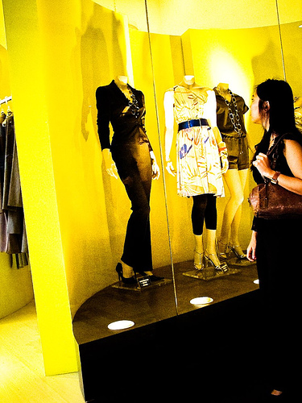

## Project_Image_Captioning
With the help of this project, machine can generate its own captions related to the image. The model uses Flickr dataset for training data and uses LSTM for training.

The Model made contains:
 1.Image model: for reducing images into selected features.
 2.Language model: for reducing output of dictionary size to word embeddings using keras inbuilt embedding layer
 3.Final model: which will concatenate results of both this model and will use LSTM layer and Time Distributed layer.
  
  
One of example of final prediction:

  
  A woman is looking at some mannequins in a window display .
